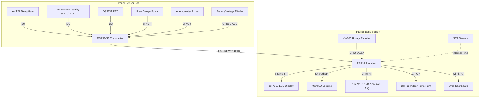

# 🌦️ ESP32 Meteo — Dual-Unit Smart Weather Station

A premium, dual-unit DIY Weather Station powered by two ESP32 microcontrollers. This system splits duties between an **Exterior Transmitter Unit** (low-power, solar/battery-friendly sensor pod) and an **Interior Receiver Unit** (featuring a local graphical display, rotary navigation, status LED ring, local SD data logging, and a rich, responsive local web dashboard).

The two units communicate wirelessly via the **ESP-NOW** protocol.

---

## 🏗️ System Architecture



---

## ⚡ Key Features

### 📡 Wireless Communication
*   **ESP-NOW Integration:** Uses ESP32's native 2.4GHz peer-to-peer protocol for instant, ultra-low power packet transfer (27-byte custom payload). No external radio transceivers (like CC1101) needed!
*   **Checksum Verification:** Custom XOR checksum validation ensuring data integrity on every packet.

### 🍃 Exterior Unit (Transmitter)
*   **Deep Sleep Optimization:** Enters low-power deep sleep mode between transmissions (configured to 5-minute intervals) to run indefinitely on solar/battery power.
*   **Sensor Suite:**
    *   **AHT21:** Accurate outdoor temperature & relative humidity.
    *   **ENS160:** Air quality monitor yielding equivalent $CO_2$ (eCO2) and Total Volatile Organic Compounds (TVOC).
    *   **DS3231 RTC:** High-accuracy hardware real-time clock to timestamp data packets.
    *   **Anemometer:** Magnetic pulse sensor (KY-003) measuring wind speed over a calibrated 3-second sampling window.
    *   **Rain Gauge:** Magnetic bucket-tip sensor (KY-003) measuring rainfall accumulation in real-time.
    *   **Battery Monitor:** Onboard ADC divider tracking battery/solar health.

### 🏠 Interior Unit (Receiver / Hub)
*   **Local UI & Navigation:** 
    *   **ST7565 Monochrome LCD:** High-contrast SPI screen rendering active meteorological telemetry.
    *   **KY-040 Rotary Encoder:** Smooth menu navigation, screen switching, and settings adjustment.
*   **Environment & Aesthetics:**
    *   **DHT11:** Monitors local indoor temperature and humidity.
    *   **NeoPixel Ring (16 LEDs):** Dynamic visual notification ring displaying status, air quality indexes, or weather warnings.
*   **Logging & Time Synchronization:**
    *   **MicroSD Logging:** Persistent historical backups. Uses custom SPI Bus sharing logic to prevent bus contention with the LCD.
    *   **NTP Time Sync:** Automatic time updates via Wi-Fi (`pool.ntp.org`) with automatic daylight savings management.
*   **Modern Web Dashboard:**
    *   Responsive web interface served directly from the ESP32 (`ESPAsyncWebServer`).
    *   Real-time graphs, historical stats, and instant diagnostic metrics.

---

## 📂 Repository Structure

```ini
├── shared/
│   └── packet.h             # Shared packet layout and checksum algorithms
├── exterior/                # Transmitter firmware
│   ├── src/
│   │   ├── config.h         # Hardwired pins, intervals, and conversions
│   │   ├── main.cpp         # Main execution, packet assembler & sleep cycle
│   │   ├── sensors.cpp/h    # Sensor drivers (AHT21, ENS160, Wind, Rain, Battery)
│   │   └── radio.cpp/h      # ESP-NOW setup & transmission
│   └── platformio.ini       # PlatformIO project configuration
└── interior/                # Receiver firmware
    ├── data/                # SPIFFS/LittleFS web server static files
    │   ├── index.html       # Dashboard HTML structure
    │   ├── style.css        # Responsive, premium CSS design
    │   └── script.js        # Dynamic AJAX/JS client logic
    ├── src/
    │   ├── config.h         # Hardwired pins, Wi-Fi credentials & settings
    │   ├── main.cpp         # Hub controller, loop coordinators & callbacks
    │   ├── display.cpp/h    # ST7565 LCD display layout & rendering
    │   ├── encoder.cpp/h    # KY-040 rotary encoder interrupts & state machine
    │   ├── neopixel.cpp/h   # Dynamic 16-LED ring illumination patterns
    │   ├── radio.cpp/h      # ESP-NOW receiver callbacks
    │   ├── storage.cpp/h    # SD Card logger and file handlers
    │   ├── spi_manager.cpp/h# Mutex manager preventing SPI bus conflicts
    │   ├── web_server.cpp/h # HTTP API endpoints and static file routes
    │   └── wifi_manager.cpp/h# Wi-Fi auto-reconnector & NTP sync routine
    └── platformio.ini       # PlatformIO project configuration
```

---

## 🔌 Hardware Configurations

### Exterior Pinout (Transmitter)
| Component | Sensor Pin | ESP32 GPIO | Description |
|---|---|---|---|
| **I2C Bus** | SDA | **GPIO 8** | Shared with AHT21, ENS160, DS3231 |
| **I2C Bus** | SCL | **GPIO 9** | Shared with AHT21, ENS160, DS3231 |
| **Rain Gauge** | OUT (KY-003) | **GPIO 4** | Pulse Interrupt |
| **Anemometer** | OUT (KY-003) | **GPIO 5** | Pulse Interrupt |
| **Battery ADC** | Voltage Divider | **GPIO 6** | Analog Input |

### Interior Pinout (Receiver & Hub)
| Component | Module Pin | ESP32 GPIO | Description |
|---|---|---|---|
| **SPI Bus** | CLK | **GPIO 12** | Shared SPI Clock |
| **SPI Bus** | MOSI | **GPIO 11** | Shared SPI Data In |
| **SPI Bus** | MISO | **GPIO 14** | Shared SPI Data Out |
| **ST7565 LCD** | CS | **GPIO 10** | Chip Select (Display) |
| **ST7565 LCD** | D/C | **GPIO 9** | Data/Command Control |
| **ST7565 LCD** | RST | **GPIO 8** | Screen Reset |
| **ST7565 LCD** | BL | **GPIO 7** | Backlight Control |
| **MicroSD Card**| CS | **GPIO 13** | Chip Select (SD) |
| **KY-040 Encoder**| CLK | **GPIO 5** | Clock Output |
| **KY-040 Encoder**| DT | **GPIO 6** | Data Output |
| **KY-040 Encoder**| SW | **GPIO 17** | Switch/Button Press |
| **WS2812B Ring**| DI | **GPIO 48** | NeoPixel Signal line |
| **DHT11** | DATA | **GPIO 4** | Ambient Indoor Readings |

---

## 🚀 Getting Started

### 1. Requirements
*   **VS Code** with the **PlatformIO IDE** extension installed.
*   Two ESP32 boards (configured in `platformio.ini`).

### 2. Configure Wi-Fi & Credentials
Before flashing, open [interior/src/config.h](file:///c:/Users/marku/Desktop/Arduino/ESP32%20Meteo/Codi%20Antigrav/interior/src/config.h) and set your local network credentials:
```cpp
#define WIFI_SSID          "Your_SSID"
#define WIFI_PASSWORD      "Your_WiFi_Password"
```

### 3. Flash the Exterior Unit
1. Open the `exterior` folder in VS Code / PlatformIO.
2. Connect your transmitter ESP32 via USB.
3. Click the **PlatformIO: Upload** button (arrow icon in status bar).

### 4. Upload Files & Flash the Interior Unit
1. Open the `interior` folder in VS Code / PlatformIO.
2. Connect your receiver ESP32 via USB.
3. **Upload Filesystem Image:** Go to the PlatformIO tab -> select your environment -> Click **Upload Filesystem Image** (to load the `data/` folder files onto the ESP32's SPIFFS/LittleFS).
4. Click **PlatformIO: Upload** to flash the main program code.

---

## 📊 Web Dashboard API Endpoints

The interior unit hosts an asynchronous HTTP server providing JSON APIs:
*   `/api/data` - Returns the latest combined outdoor and indoor measurements.
*   `/api/history` - Returns historical records logged from the SD card.

---

## 🛠️ Built With
*   **Framework:** Arduino Core for ESP32
*   **Build System:** PlatformIO
*   **Key Libraries:**
    *   `ESPAsyncWebServer` & `AsyncTCP` for high-performance dashboard routing.
    *   `Adafruit NeoPixel` for status LEDs.
    *   `Adafruit DHT` for indoor temp/humidity readings.
    *   Custom lightweight non-blocking LCD libraries for the ST7565.
